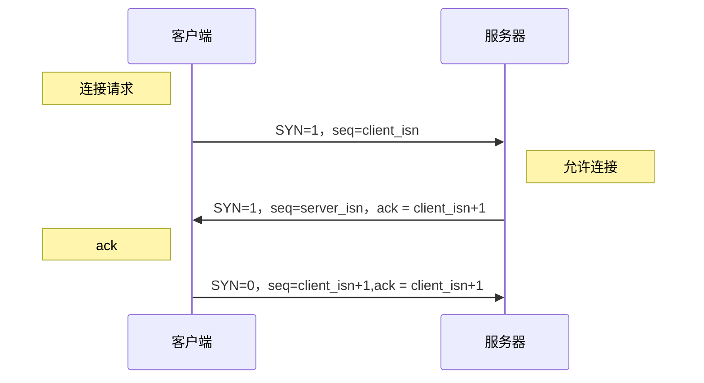

# 网络io与select poll epoll
=====

## 简介
   一个对话框实验，主要用于理解网络io，使用了阻塞，多线程，select，poll，epoll等多种方式 
## 三次握手四次挥手

首先还是需要搞清楚三次握手和四次挥手的过程

### 三次握手

## 网络IO模型中的阻塞与多路复用及其实现

### 1.阻塞——单线程与多线程
  * accept位于whlie循环之前：只能连接一个客户端
  * accept位于whlie循环之中：能连接多个客户端，但只能接收一条消息
  * thread 多线程
    * 每个请求对应一个线程，但是多线程需要进行CPU的上下文切换
    * 优点：结构简单
    * 缺点：无法支持大量客户端
### 2.多路复用select

* 执行流程
    1.select 是一个阻塞函数，当没有数据时，会一直阻塞在select这一行
    2.当有数据时会将reset中对应的那一位置1
    3.select函数返回不再阻塞
    4.遍历文件描述符数组，判断哪个fd被置1了
    5.读取数据，然后处理
* 缺点
    1.所使用的bitmap默认大小是1024，虽然可以调整但还是有限
    2.rset每次循环都必须重新置1，不可以重复使用
    3.尽管将rset从用户态拷贝到内核态，由内核态判断是否有数据，但是还是有拷贝的开销
    4.当有数据时select就会返回，但是select不知道哪个文件描述符发生变化，还需要进行遍历，效率比较低
### 3.多路复用poll
  * pollfd结构体
    * fd：文件描述符
    * events：对应的时间，如果是读事件就是POLLIN，如果是写事件就是POLLOUT
    * revents：对events的反馈，开始时为0，当有数据可读时就为POLLIN，类似select的rset

  * 执行流程
    1.将需要用到的fd从用户态拷贝到内核态
    2.poll为阻塞方法，执行poll方法，如果有数据会将fd对应的revents置为POLLIN
    3.poll方法返回
    4.循环遍历，查找哪个fd被置为POLLIN
    5.将revents重新置0，便于复用
    6.将置位的fd进行读取和处理
  * 对于select提升的地方
    1.解决了bitmap的1024大小限制
    2.解决了rset不可重用的情况
  * 弊端
    1.每次poll都仍要重新遍历全量的fds
    2.服务程序也要遍历全量的fds，查看每个文件描述符的revents字段是否需要读写操作
### 4.多路复用epoll
* epoll_create() 返回一个文件描述符，该文件描述符“描述”的是内核中的一块内存区域，size现在不起任何作用。
* epoll_ctl()用来操作内核事件表，
  * int epfd表示epoll_create() 返回的事件表
  * int fd:新创建的socket文件描述符
  * int op
    * EPOLL_CTL_ADD: 事件表中添加一个文件描述符，内核应该关注的socket的事件在epoll_event结构体中，添加到事件表中的文件描述符以红黑树的形式存在，防止重复添加
    * EPOLL_CTL_MOD：修改fd上注册的事件
    * EPOLL_CTL_DEL：删除fd上注册的事件
* struct epoll_event *event
* epoll_wait()该函数返回就绪文件描述符的个数

    

